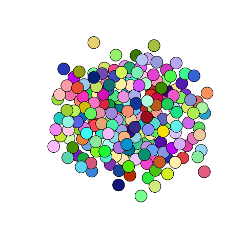
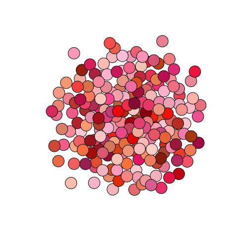
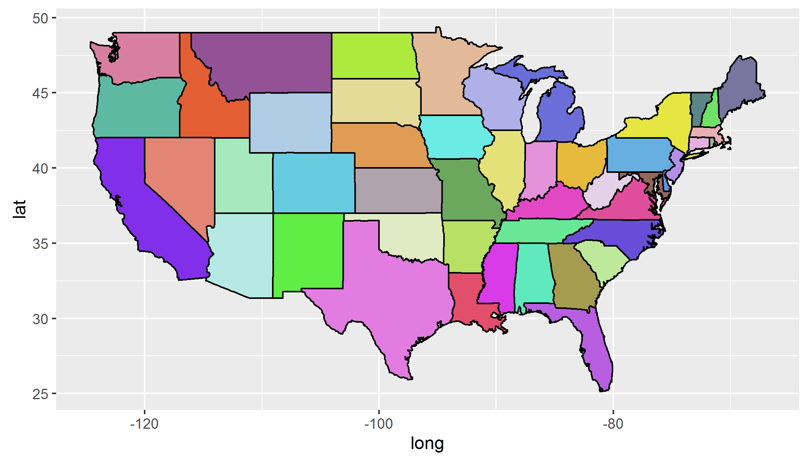

# randomcoloR

An [R](https://www.r-project.org/) package for generating attractive and distinctive colors.

The `randomColor()` function is ported from [randomColor.js](https://github.com/davidmerfield/randomColor).

Let's quickly get some pretty random colors.
```r
library(igraph)
library(randomcoloR)

k <- 200
plot(erdos.renyi.game(k, 0.1), vertex.label=NA,
     edge.lty="blank", vertex.color=randomColor(k))
```


We can specify a particular hue, such as red.
```r
plot(erdos.renyi.game(k, 0.1), vertex.label=NA,
     edge.lty="blank", vertex.color=randomColor(k, hue="red"))
```


We can also get random colors with specific luminosity.
```r
plot(erdos.renyi.game(k, 0.1), vertex.label=NA,
     edge.lty="blank", vertex.color=randomColor(k, luminosity="light"))
```


We can also ask for a set of optimally distinct colors so that colors in our plot are not too similar.
If we use `ggplot2` to select the color space for our states in the map below, we get many similar colors.
```r
library(dplyr)
library(ggplot2)
library(maps)

states_map <- map_data("state")
ggplot(states_map, aes(x=long, y=lat, group=group)) +
  geom_polygon(aes(fill=region), color="black") +
  guides(fill=FALSE)
```
*Which states are green?*


Instead, let's find the most distinctive set of colors for all states.
```r
s <- unique(states_map$region)
df <- data.frame(region=s, newColor=distinctColorPalette(length(s)),
                 stringsAsFactors=FALSE)
states_map <- left_join(states_map, df, by="region")
ggplot(states_map, aes(x=long, y=lat, group=group)) +
  geom_polygon(fill=states_map$newColor, color="black")
```
*Now, which states are green?*

